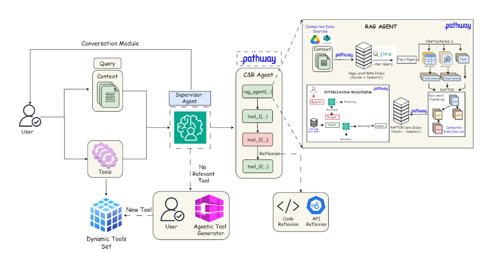
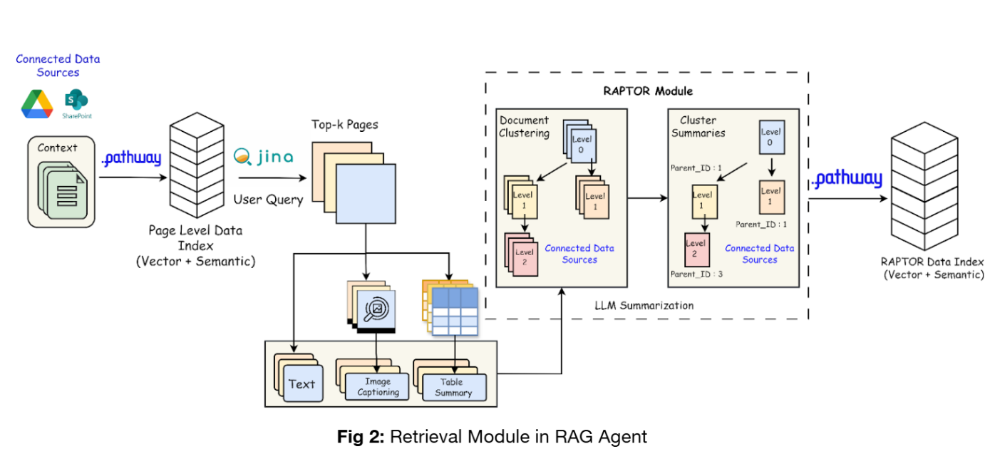
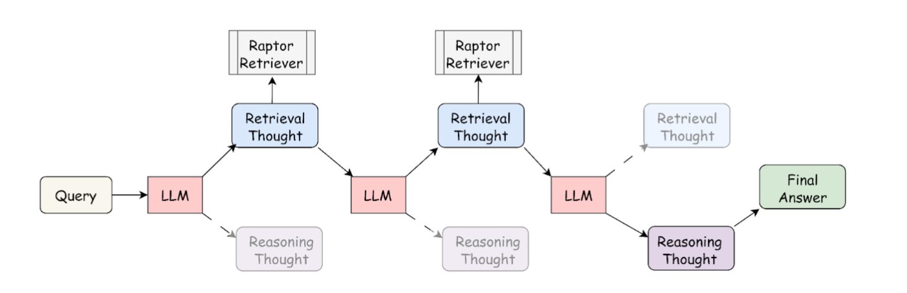
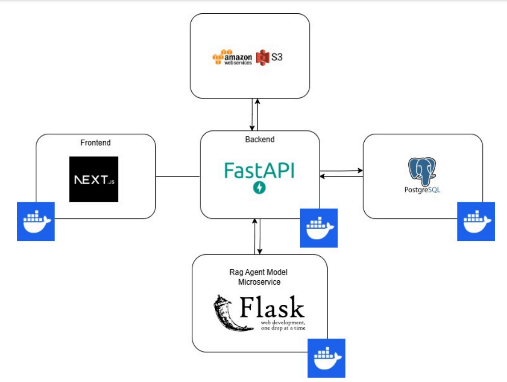
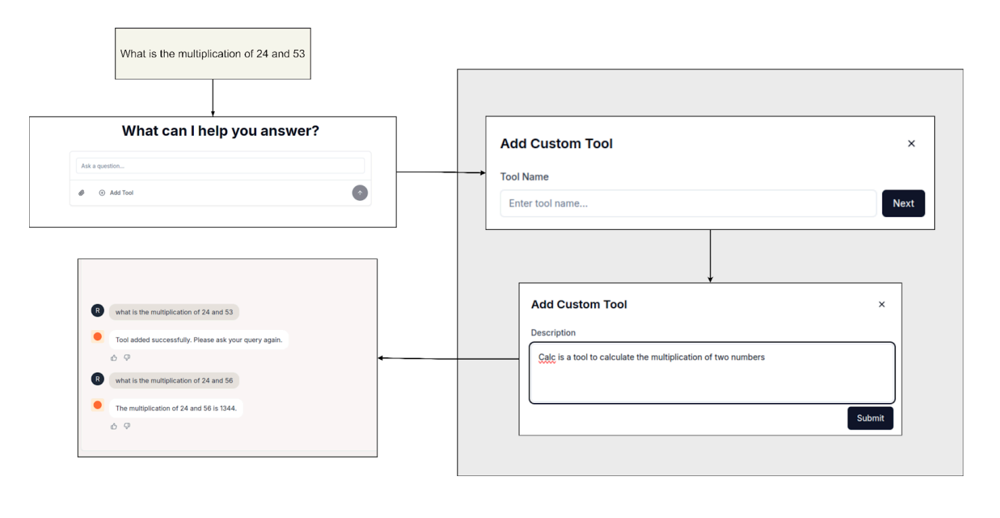

# Dynamic Agentic RAG with Pathway

In this work, we develop a dynamic agentic RAG system for long, intricate legal and financial documents. Such a system requires orchestrating multiple agents for efficient context retrieval and reasoning, along with tool-reasoning capabilities to handle domain-specific tasks. The system should be robust and have decision making abilities to handle different user use cases and failure scenarios.

# Approach



The workflow begins by receiving a query Q, a set of documents D, and a set of tools T from the user. The tools can be user-provided or pre-defined as well. Given the above information, the supervisor agent first activates the Code & Reasoning agent, which can interact with tools and the RAG agent. Upon activation, the RAG Agent builds a document index for D using Pathway's VectorStore Server. It then utilizes Jina Embeddings to perform page-level retrieval and extract the top-k most relevant pages for Q. The pages are chunked and indexed using RAPTOR, forming a hierarchical structure over the summary of the chunks. 



Once indexing is complete, the RAG agent uses an interleaving approach to iterate between reasoning and retrieval to perform multi-hop contextual reasoning and return the RAG response. This allows for dynamic decision-making and real-time transformation of retrieval queries to ensure the successful retrieval of relevant context, eliminating the need for a separate critic agent.



The Code & Reasoning (C&R) agent can further utilize the tools for any tool-specific task based on the RAG agent's response and user query. Finally, the Supervisor Agent consolidates the outputs and returns the response to the user. It follows a Chain of Function Call (CoFC) policy where it invokes a single tool call at each step.


# Usage 1 (Colab Notebook)
> [!IMPORTANT]
> Use a Google Colab Runtime.

- First, download the Jupyter notebook[insert nb] and connect to a Colab standard runtime. 
- Run the **Imports** cell. There will be a message to restart the runtime, kindly do so.
- In the **API Keys** section, please provide all the relevant API keys.
- Run each section one by one, starting from **Guardrails** to **Tools**.
- Once you run the **Inference** section, you will be asked to provide the path of the PDF over which you wish to perform question answering, along with your query. Kindly do the needful.
- After a few minutes, the response to your query will be provided.

> [!NOTE]
> The tool list in the "Tools" section contains a few default tools; one can also provide custom tools (with proper docstrings).

Please find an interactive documentation of our modular codebase at [insert link here]. Kindly refer to the same for a detailed description of our entire codebase and the integration of various system components with
$\textsf{\color{blue} Pathway}$

# Usage 2 (Web Application)

## Installation

You can run all the frontend, backend, model-microservice, and database using the given commands. Please Note that all the paths are relative to the submission folder

### Frontend
```bash
make frontend-all
```
(or)
```bash
cd frontend
npm i
npm run dev
```
### Database
```base
make database-up-create
```
### Model Microservice
Kindly fill in all the environment variable before running it in development mode

./model-microservice/rag_agent/.env
```py
RAPTOR_GROQ_API_KEY=
RAG_GROQ_API_KEY=
SUPERVISOR_GROQ_API_KEY= 
CLIENT_GROQ_API_KEY=
UNSTRUCTURED_API_KEY=
UNSTRUCTURED_API_URL=
JINAAI_API_KEY=
EMBED_JINA_API_KEY=
TOGETHER_API_KEY=
TAVILY_API_KEY=
```
```bash
make model-microservice-all
```
(or)

For Linux
```bash
cd model-microservice
pip install -r requirements.txt
python -m venv venv
source venv/bin/activate
python main.py
```
For Windows
```bash
cd model-microservice
pip install -r requirements.txt
python -m venv venv
.\venv\Scripts\activate
python main.py
```

### Backend
Kindly fill in all the environment variable before running it in development mode

./backend/.env
```py
POSTGRES_USER=
POSTGRES_PASSWORD=
POSTGRES_HOST=
POSTGRES_DB=
AWS_ACCESS_KEY_ID=
AWS_SECRET_ACCESS_KEY=
AWS_REGION=
AWS_BUCKET_NAME=
```
```bash
make backend-all
```
(or)

For Linux
```bash
cd backend
pip install -r requirements.txt
python -m venv venv
source venv/bin/activate
python main.py
```
For Windows
```bash
cd backend
pip install -r requirements.txt
python -m venv venv
.\venv\Scripts\activate
python main.py
```


# System Architecture 




- Fully functional web application using a modern tech stack to ensure scalability, performance, and ease of deployment. 
- The frontend has been built using Next.js, providing seamless and dynamic user experience. The frontend connects to a FastAPI-based backend gateway, which serves as the central communication hub, managing interactions with various subsystems.
- The backend gateway integrates with an Amazon S3 bucket for efficient and secure storage of PDF. 
- Additionally, it connects to a Flask-based microservice that powers an agentic Retrieval-Augmented Generation (RAG) system, enabling intelligent and context-aware document processing. 
- For data management, we have utilized PostgreSQL as the
database management system (DBMS), ensuring reliable and scalable data storage and retrieval.
- All services, including the frontend, backend, microservices, and database, have been containerized using Docker. 

This approach simplies development workows and ensures the application is production-ready with consistent and isolated environments across various stages of deployment.


# Web UI 



